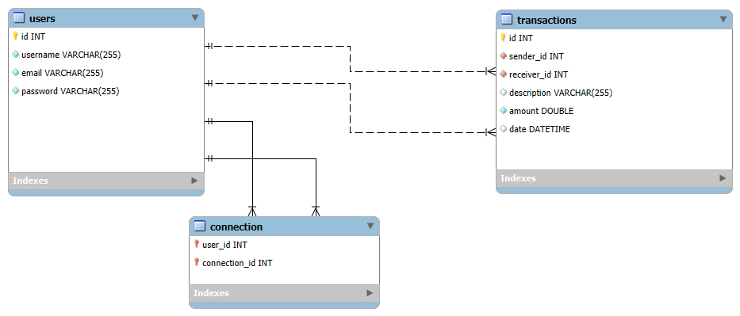

# Application name: PayMyBuddy

## PayMyBuddy is an application for money transfer, to manage finances or pay friends

## Table of contents

- [Prerequisites](#prerequisites)
- [Installation](#installation)
- [Usage](#usage)
- [Database Structure](#database-structure)
- [SQL Scripts](#sql-scripts)

## Prerequisites

- Java 21
- Maven
- Spring 3
- IDE like Eclipse or IntelliJ IDEA

## Installation

1. Clone the repository 

git clone https://github.com/MichelleMair/paymybuddy_app.git

2. Navigate to the project directory : cd PayMyBuddy

3. Install the Maven dependencies: mvn clean install 

4. Set up MySQL database using the provided SQL scripts in `src/main/resources/db`

## Usage

1. Start Spring Boot application: mvn spring-boot:run

2. Access the application at http://localhost:8080

## Database Structure

The physical data model (PDM) is described below

Diagram
```markdown

```


## SQL Scripts

1. To see SQL scripts for PayMyBuddy, navigate to `src/main/resources/db`

2. `schema.sql`to create tables 

3. `data.sql`to insert data