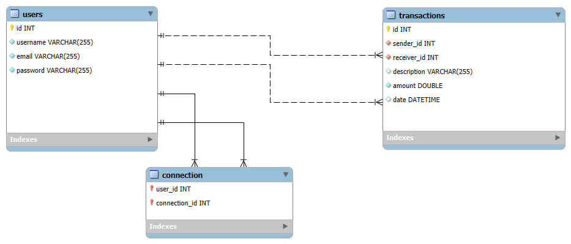

# Application name: PayMyBuddy

## PayMyBuddy is an application for money transfer, to manage finances or pay friends

## Table of contents

- [Prerequisites](#prerequisites)
- [Installation](#installation)
- [SSL Configuration](#ssl-configuration)
- [Usage](#usage)
- [Database Structure](#database-structure)
- [SQL Scripts](#sql-scripts)

## Prerequisites

- Java 21
- Maven
- Spring 3
- IDE like Eclipse or IntelliJ IDEA
- MySQL 8.0 or higher

## Installation

1. Clone the repository 

git clone https://github.com/MichelleMair/paymybuddy_app.git

2. Navigate to the project directory : cd PayMyBuddy

3. Install the Maven dependencies: mvn clean install 

4. Set up MySQL database using the provided SQL scripts in `src/main/resources/db`

## SSL Configuration

If you need to secure the connection between the application and MySQL using SSL, follow these steps:

1. Enable SSL in MySQL:
Ensure that your MySQL server is configured to support SSL. You can check it by running:
'SHOW VARIABLES LIKE '%ssl%';'

If SSL is not enabled, you may need to configure MySQL server accordingly by updating the MySQL configuration file (my.ini or my.cnf) to include:

[mysqld]
ssl-ca=ca.pem
ssl-cert=server-cert.pem
ssl-key=server-key.pem

Restart the MySQL server after making these changes.

Ensure the paths to 'ca.pem', 'server-cert.pem' and 'server-key.pem' are correctly set. 
And thoses files exist in your MySQL data directory.

2. Database Setup:

Test the connection after configuring the SSL connection

Ensure that the MySQL database is set up and running

Import the initial schema and data if required (see 'SQL scripts' section).

## Usage

1. Start Spring Boot application: mvn spring-boot:run

2. Access the application at http://localhost:8080

## Database Structure

The physical data model (PDM) is described below

Diagram

## SQL Scripts

1. To see SQL scripts for PayMyBuddy, navigate to `src/main/resources/db`

2. `schema.sql`to create tables 

3. `data.sql`to insert data
